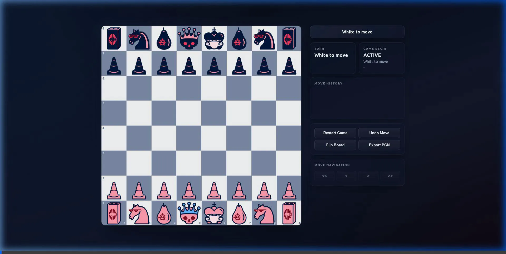
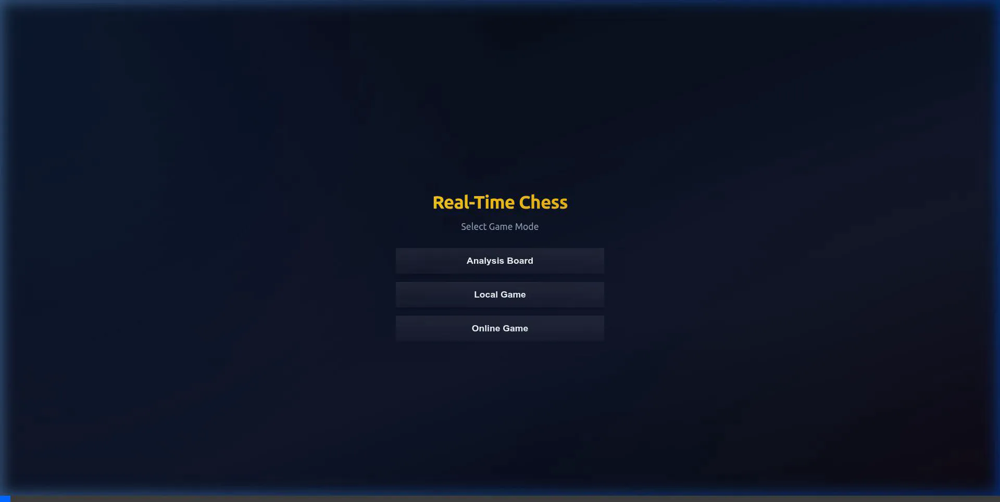

# 👑 Real-Time Chess Platform

[](https://real-time-chess-platform.onrender.com)

A premium, production-ready browser-based Chess application featuring robust real-time multiplayer, game history review, multiple gameplay modes, and a strict compliance engine enforcing complete FIDE chess rules. Built from the ground up using **Vanilla JS (ES Modules)**, **Express**, and **Socket.io**.

---

## 🎬 Gameplay Demos & Layouts

### 1. Game Verification & Gameplay Flow
Active move execution, piece highlights, coordinate border labels, and live status feedback panel.


### 2. Startup Menu & Game Modes
The landing menu allows instant selection of Analysis Board, Local Game (with timer selections), or Online Multiplayer.


### 3. Responsive Desktop Sidebar Design



### 4. Real-Time Online Matchmaking
Room creation with room codes, live matchmaking screen status, and instant room synchronization.


---

## 🚀 Key Features

### 🕹️ Gameplay Modes
*   **Analysis Board**: Import and export custom game positions using **FEN (Forsyth-Edwards Notation)** strings. Features unlimited move undo/redo operations and free history review.
*   **Local Game**: Play on a single device with customized time controls. The chessboard automatically rotates (flips) at the end of each turn so players are always facing their side.
*   **Online Multiplayer**: Connect to matches in real-time over Socket.io. Players can create rooms with precise time controls, share 5-character room codes, sync game timers, resign matches, and handle opponent disconnections gracefully.

### 🛡️ Strict Chess Rules Engine
Enforces standard FIDE chess rules through simulation-based legal-move filtering:
*   **Check & Checkmate Detection**: Highlights the king when checked and blocks illegal moves that expose the player's own king.
*   **Stalemate & Draws**: Automatic detection of Draw scenarios including:
    *   **Threefold Repetition**: Enforced via live position hashing.
    *   **Fifty-Move Rule**: Tracks half-move clocks without pawn moves or captures.
    *   **Insufficient Material**: Checks for King vs. King, King + Bishop vs. King, King + Knight vs. King, and Bishops on same color.
*   **Special Moves**:
    *   **Castling**: Enforces paths, rook/king movements, and check constraints, applying atomic king and rook moves in DOM/state.
    *   **En Passant**: Automatically generates captures when adjacent pawns push two ranks.
    *   **Pawn Promotion Picker**: Displays a modal allowing the player to promote a pawn to a Queen, Rook, Bishop, or Knight. Updates SAN notation dynamically.

### 🎨 Visual & UI Polish
*   **Modern Responsive Styling**: A fluid, glassmorphic layout that behaves as a horizontal split-panel sidebar on desktop screens and stacks vertically on mobile.
*   **Coordinates Overlay**: Board ranks (`1-8`) and files (`a-h`) are visually labeled along the chessboard border, preserving their alignment even when the board is flipped.
*   **Move Navigation (Review Mode)**: Click `<<`, `<`, `>`, or `>>` buttons to review prior game positions. In review mode, board interaction is disabled to prevent accidental moves. Clicking `>` at the end of the timeline restores live play seamlessly.
*   **PGN Export**: Generates and downloads standard Portable Game Notation (`.pgn`) history files complete with Event, Site, Date, Result, and SAN move notation headers.

---

## 📂 Project Structure

```bash
├── Assets/                 # SVG assets for pieces and verification recordings
│   ├── images/pieces/      # White and Black piece SVGs (classic / styled)
│   └── recordings/         # Gameplay WebP recordings referenced in README
├── Data/                   # Chess state, rules engine, and data layers
│   ├── data.js             # Initial state definitions for squares and pieces
│   ├── pieces.js           # Factory methods for pieces and asset loading
│   ├── engine.js           # Core chess rules, move generator, and simulation
│   └── state.js            # Centralized game state management and undo histories
├── Events/
│   └── global.js           # Event listeners, client matchmaking, and move handling
├── Helper/
│   ├── constants.js        # Global DOM element selectors
│   └── fen.js              # Parsers and encoders for FEN notation strings
├── Render/
│   └── main.js             # DOM builders, coordinate markers, and board rendering
├── scratch/                # Automated Node.js test suites
│   ├── mock_dom.js         # Headless browser mock for testing without browser
│   ├── test_suite.js       # Main rules validation suite (23 FIDE test cases)
│   ├── test_modes.js       # Timer, FEN, and game mode tests
│   ├── test_phases.js      # Navigation review, PGN, and board flip tests
│   └── test_online.js      # Server-client Socket.io matchmaking verification
├── index.html              # Main HTML entry shell
├── index.js                # JS Bootstrapper, layout builder, and game loop
├── server.js               # Express & Socket.io Backend Server
├── style/
│   └── index.css           # Premium responsive layouts, borders, and animations
├── package.json            # Node project configuration and dependencies
└── PROJECT_GUIDE.txt       # Technical maintenance manual and history log
```

---

## ⚡ Quick Start

### Prerequisites
*   [Node.js](https://nodejs.org/) (v16+ recommended)
*   [NPM](https://www.npmjs.com/)

### Installation
1. Clone the repository and navigate to the project directory:
   ```bash
   git clone https://github.com/sagnik03/real-time-chess-platform.git
   cd chess-game
   ```
2. Install project dependencies:
   ```bash
   npm install
   ```

### Running the App
1. Start the Express server:
   ```bash
   node server.js
   ```
2. Open your browser and navigate to:
   ```url
   http://localhost:8000
   ```

---

## 🧪 Running the Test Suite

A comprehensive test suite is included in the `scratch/` folder. The tests mock the DOM container environment to verify all logic headlessly using Node.

Run the test modules individually or sequentially:

```bash
# Run the 23 FIDE chess rules validation tests
node scratch/test_suite.js

# Run the game modes and clock ticking tests
node scratch/test_modes.js

# Run the review navigation and PGN export tests
node scratch/test_phases.js

# Run the server Socket.io multiplayer lifecycle tests
node scratch/test_online.js
```

---

## 🛠️ Architecture Overview

The system is designed with strict separation of concerns using ES Modules:

1.  **State Manager (`Data/state.js`)**: Serves as the single source of truth (`gameState`, `globalState`). Handles deep cloning, history undo stacks, and resetting.
2.  **Move Engine (`Data/engine.js`)**: A stateless module that computes raw candidate movements for all pieces and filters out invalid check-violating moves via simulated future boards.
3.  **DOM Renderer (`Render/main.js`)**: Build-on-demand chessboard DOM wrapper. Inject coordinate labels, append drag-free SVGs, and expose ARIA attributes.
4.  **Event Handler (`Events/global.js`)**: Orchestrates human actions, UI clicks, matchmaking connections, and real-time Socket.io payloads.

---

## 📄 License
This project is licensed under the **ISC License**.
